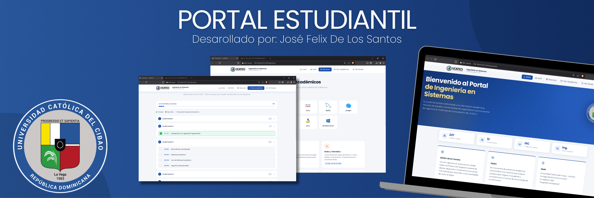

# ISC-Student-Portal

## Academic Information

**Course:** Programming III

**Professor:** Emilio Peña

**University:** Universidad Católica del Cibao (UCATECI)

**Student:** José Felix DLS

**Student ID:** 2024-1135

## Project Objective

The objective of this project is to develop an interactive and centralized web portal that facilitates the academic life of Computer Systems Engineering (ISC) students. The application serves as a practical tool that allows students to track their curriculum progress, organize their assignments, and access essential university resources all in one place.

## Description

The ISC Student Portal is a responsive Single Page Application (SPA) developed with standard web technologies (HTML, CSS, and Vanilla JavaScript). Designed with a clean, modern interface, the application features specific sections to help users understand their career profile, interactively map out their completed courses, and manage their daily academic tasks, ensuring a highly organized and efficient student experience.

## Included Modules

* **Home & Profile:** Overview of the degree, mission, vision, and professional competencies.
* **Academic Resources:** Quick links to the virtual classroom, digital library, and programming tools.
* **Academic Plan:** Interactive curriculum tracker indicating completed, available, and locked subjects based on prerequisites.
* **My Tasks (Task Manager):** A system to add, edit, and filter pending and completed assignments.

## Features

* Simple, modern, and user-friendly interface with smooth scrolling and animations.
* Content dynamically categorized by sections without reloading the page.
* Interactive visual progress bar for curriculum completion.
* Fully functional Task Manager (CRUD) with filters for "All", "Pending", and "Completed".
* Elegant modal alerts and confirmations powered by SweetAlert2.
* Responsive design adapted for both desktop and mobile viewing.

## Technologies Used

* HTML5 (Semantic structure)
* CSS3 (Custom styling, Flexbox/Grid, UI/UX design)
* Vanilla JavaScript (DOM manipulation and local state management)
* Phosphor Icons & SweetAlert2 (via CDN)

## Project Status

Completed academic project developed for educational purposes.
